# Examination Result Management System  

*version* : **1.0.3**  
*update date* : 9 August 2022  
*release date* : 22 June 2022  
*developer* : **AnimaxNeil**  

---
 

## Objective  
*The aim of this project is to help various educational institutions to effectively conduct examinations and manage the distribution of question papers, collection and assesment of answer papers, and publish results in an effective manner, in real time.*

## Problem Statement  
In most examination conduction and result processing systems that are currently in use at various educational institutions, there is a lot of manual labour and paperwork involved for the arrangement of examinations, collection and distribution of the required question papers and answer papers, and the distribution of results after the evaluation of the submitted answer papers. It becomes very difficult to manage record of all the processes involved and results in heap of files and additional labour. Not only is there a risk of loss of information due to various reasons, the process is also very labour dependent. For reducing costs, insuffecient man power with respect to the magnitude of work is very common and results in inaccuracy and delay in declaration of result. Furthur everyone wastes their valuable time for the duration of the entire examination process, evaluation of the answer papers, and collection and distribution of results. The software solution is designed to completely revolutionize the current examination system. This change is very important, especially due to the recent pandemic.  

## Project Scope  
**Examination Result Management System** is a web application, which helps an educational institution to organize its teachers and students, and conduct examinations completely remotely through the internet. The System is composed of two main components: a dynamic website (or web application) made with nodejs that can be accesed through any modern browser on any device, and a relational structured database like mysql. Both of these components may be hosted on the same server or on different servers. The product will, supposedly, revolutionize the way educational institutions conduct examinations. The project can be easily extended further to add other required functionalities to act as an web portal that serves all the requirements of the students and the faculty.  

## Product Security  
All system records are stored and served from a mysql database, which many be located on a different server. This includes user information and login credentials, as well as information related to examinations, question papers, answer papers and results. An Internet connection is necessary to access the system. Being a data-centric application it is important to implement strong security protocols at every step possible. The logged in user session is stored in the database, eleminating the risks involved with cookies. Furthermore, all communication to the database is done on the server-side in accordance to what is allowed by each user and the front end can be conveniently served via the HTTPS protocol. All these measures ensures strong security.  

## Software Requirements  
The project was developed using the latest version of nodejs at that time, v16.9.0. Although it can run on older versions safely (has been tested on versions as low as v14.x). The latest version of MySQL, v8.0, has been used, but it can run on older versions as well.  
Since the system uses a website as its front end, it can be accessed by any device that can run a modern web browser (like Chrome, Firefox, Edge, Brave, Saffari, etc).  

## Functional Overview  
Every user has to undergo login authentication in order to access the primary functions of the application. There are various invisible authentication steps at every step to ensure strong security. After a successful login, the user will be taken to their home page where they can perform the permited operations. *The application has three kinds of users - Admin, Teacher and Student.*  
**Admins** can can view and edit all information (including passwords) about all users (excluding admins), and add new users (excluding admins). They can also view and manage the various uploaded files like question papers and answer papers.  
**Teachers** can view relevent information about themselves and students in the same course. They can add, view and activate/deactivate question papers. When a question paper becomes active it is shown to the students of the same course as an ongoing exam. The teacher can view all submited answer papers for a particular question paper, evaluate them and submit marks.  
**Students** can view relevent information about themselves. They can see if there is any ongoing examination in their course. If there is, then they can view the question paper and submit their answer paper. After a teacher evaluates their answer papers, they can see their obtained marks as results.  

## Screenshots  
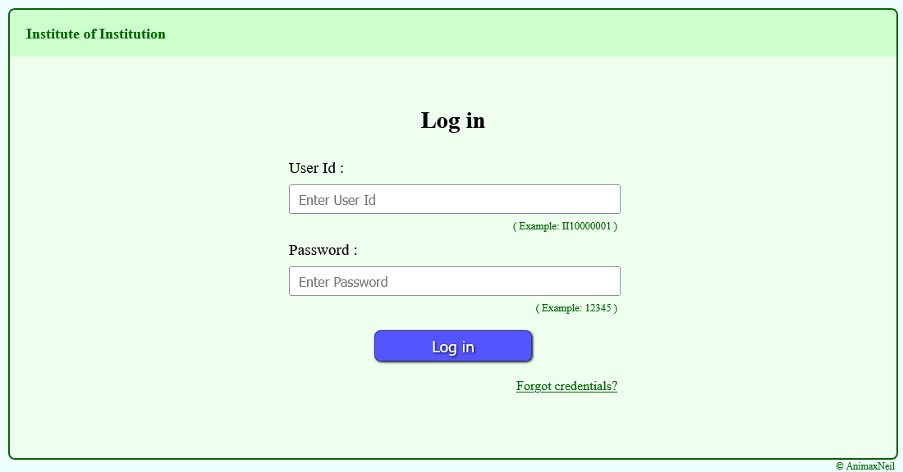
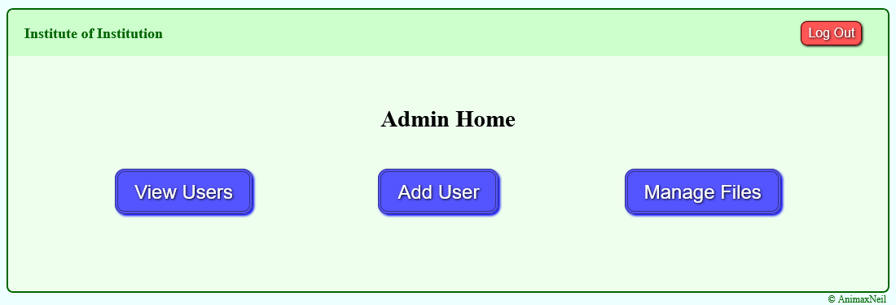
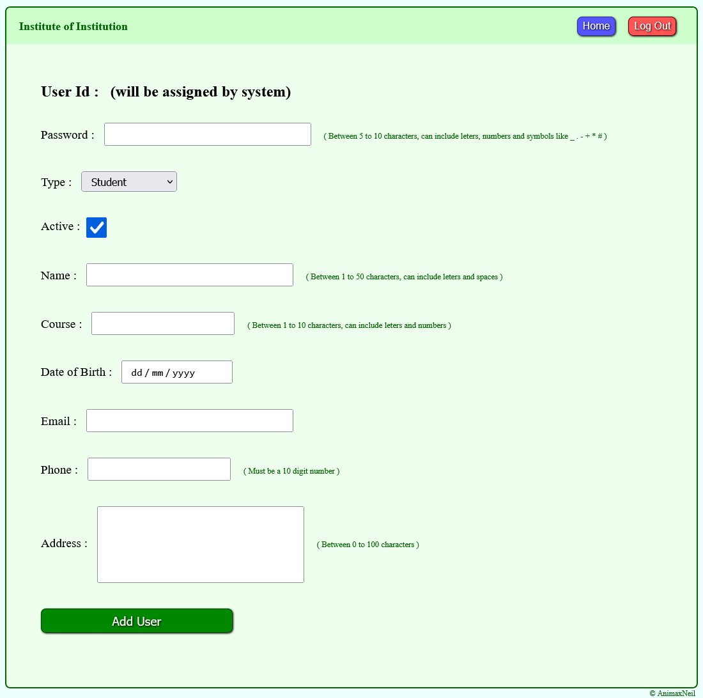
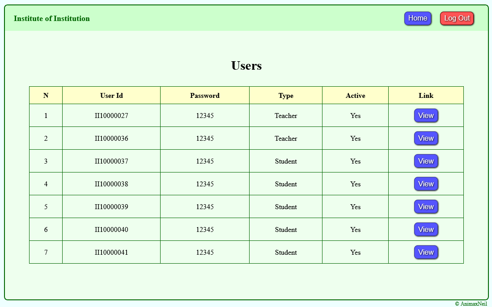
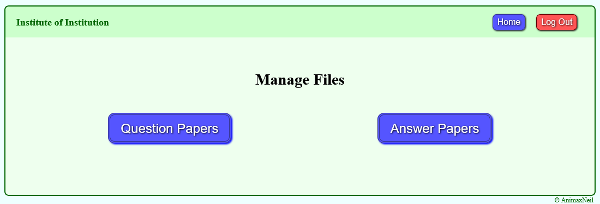
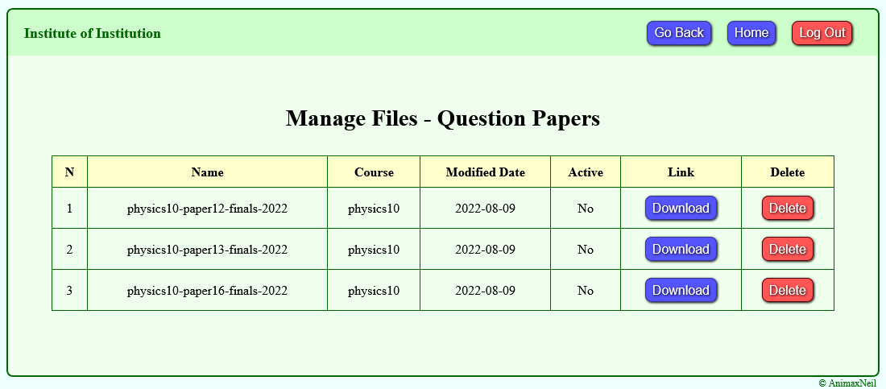
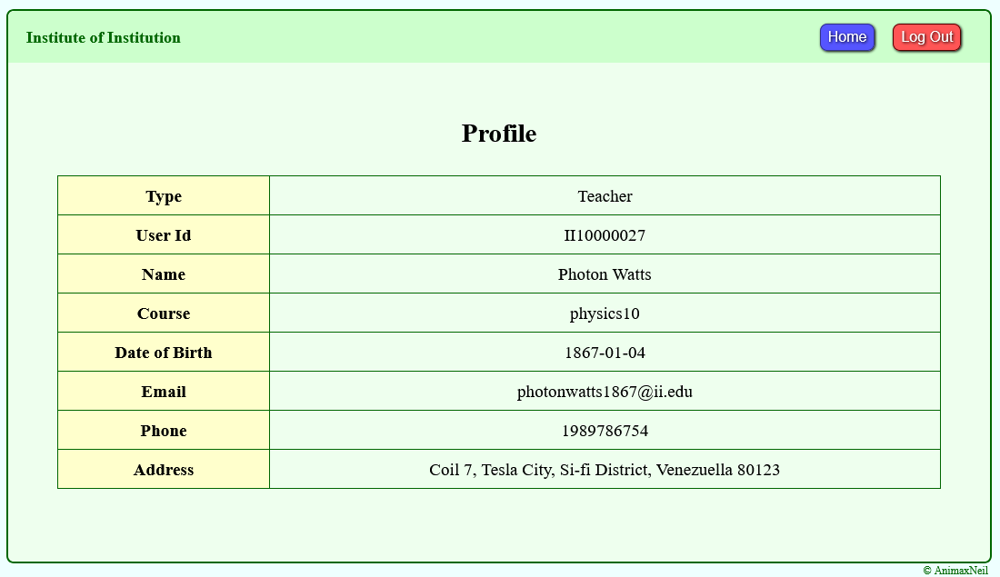
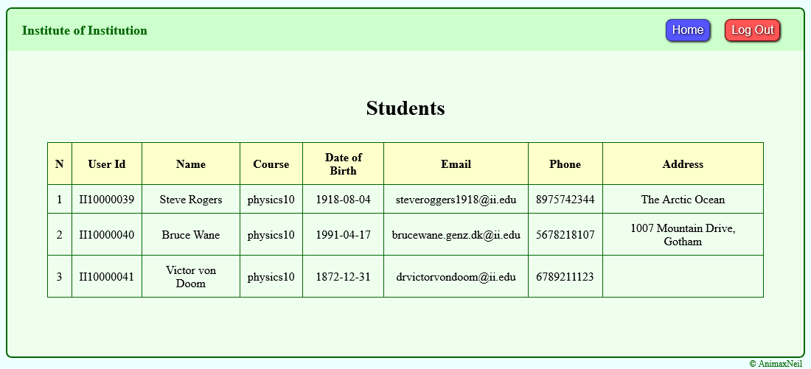
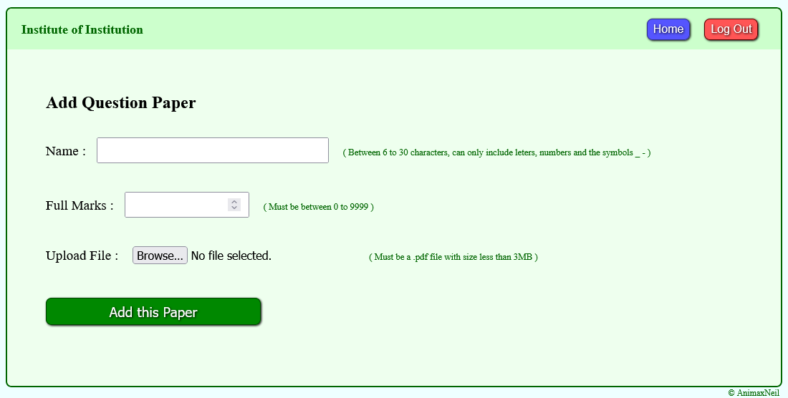
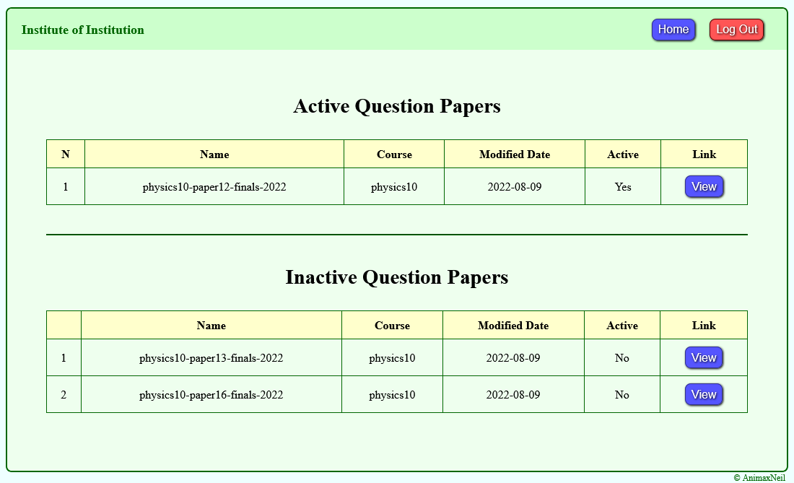
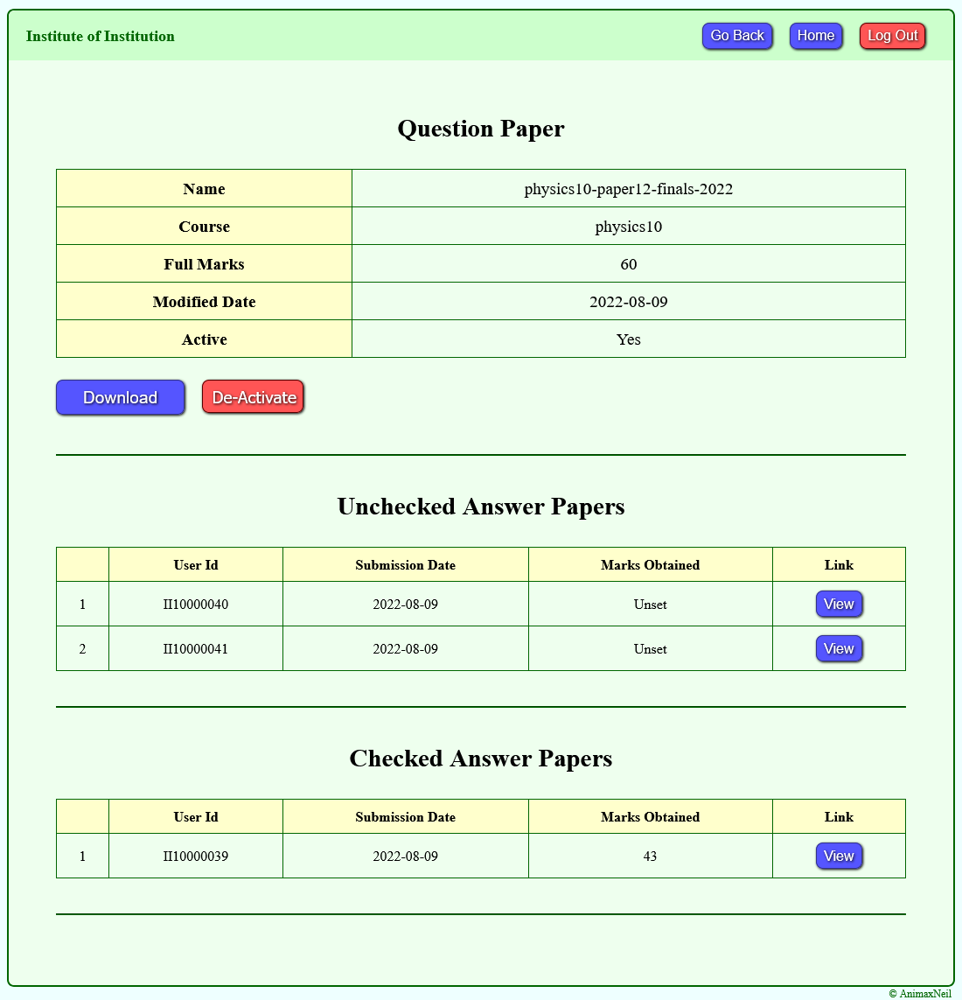
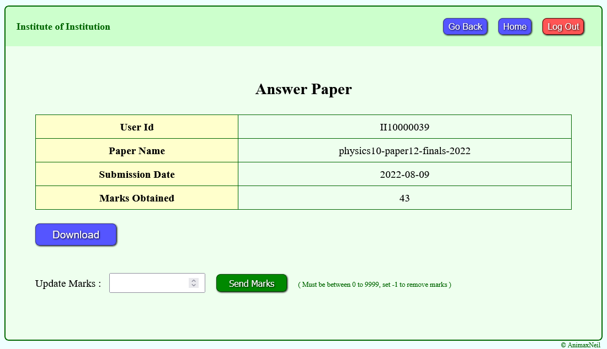
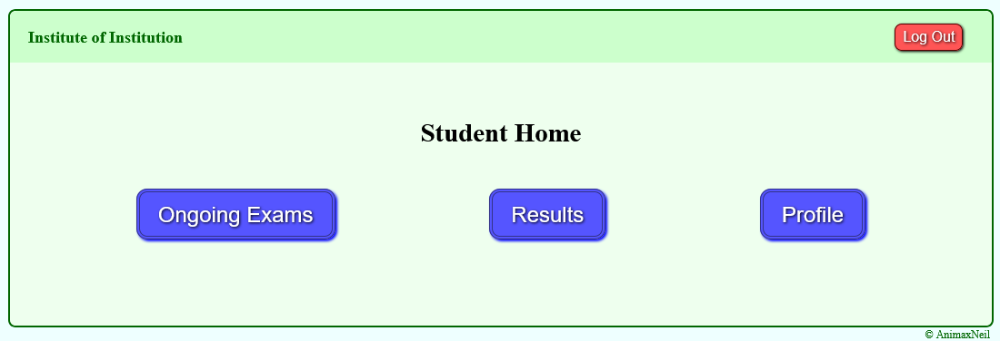
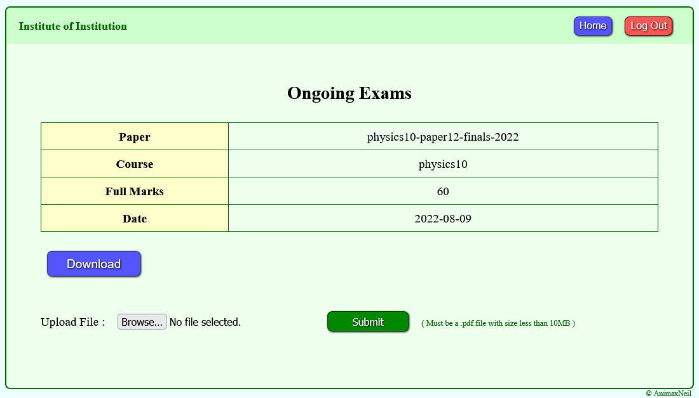
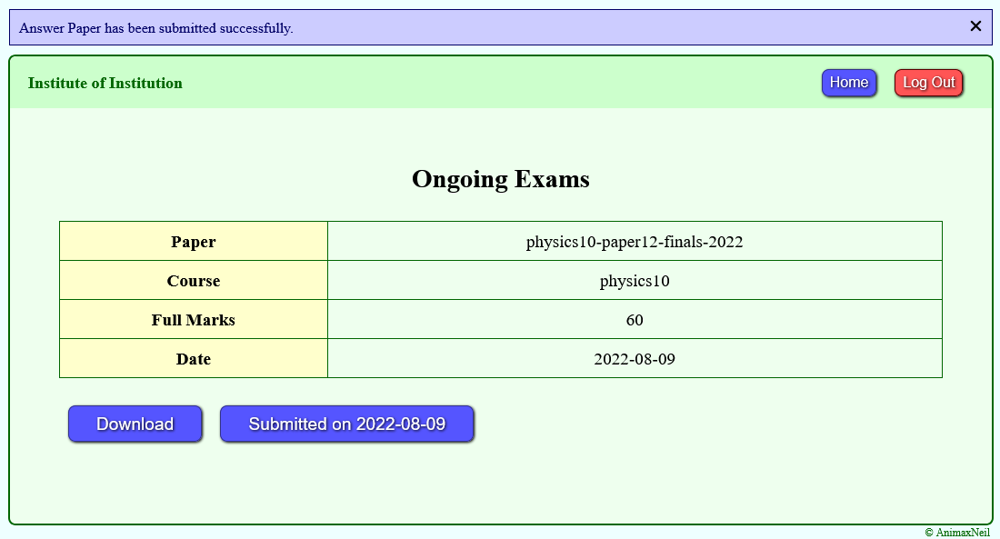
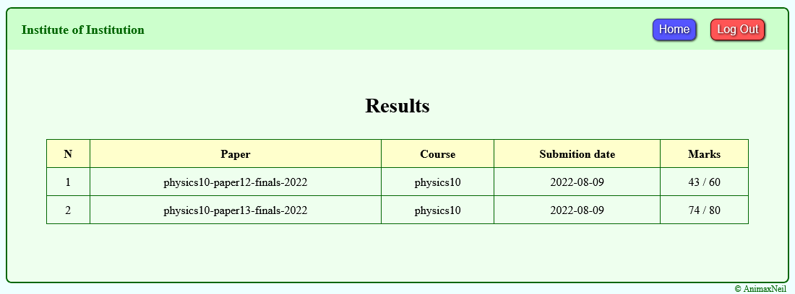

## Contact  
*email* : animaxneil@gmail.com  
*website* : https://www.animaxneil.com  
